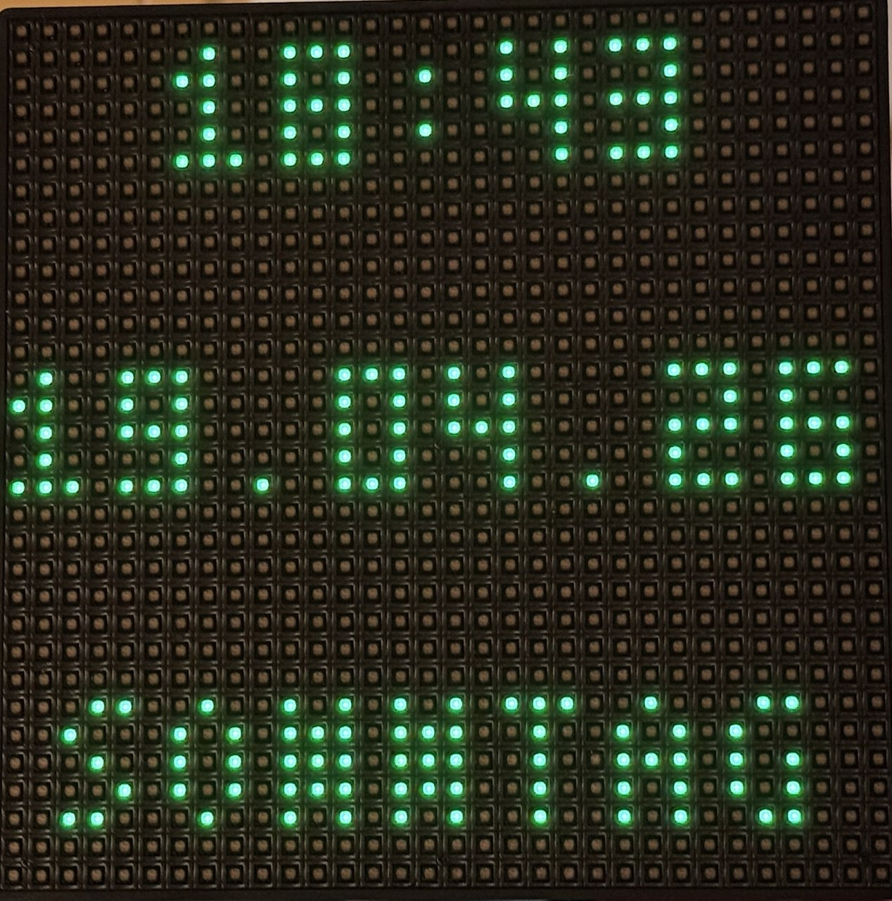

# ha-action-32x32-led
# Home Assistant ACTION 32x32 LED Display Integration

Home Assistant custom integration and setup guide for the ACTION / BK Light 32x32 BLE LED panel.

<a href="https://www.buymeacoffee.com/thoralf.brandt" target="_blank">
  
</a>

This repository focuses on a practical, Home Assistant-first workflow for the ACTION / BK Light 32x32 display:
- patched BK Light custom integration
- centered 32x32 pixel-font rendering
- fixed-row text placement
- multi-page automations
- ESP32 Bluetooth gateway setup for reliable BLE connectivity



## Included in this repository

- patched custom integration for `BK Light ACT1026`
- pixel-font based line rendering for 32x32 displays
- fixed row placement using `y_line`
- examples for multi-page automations
- Bluetooth gateway setup guide for Home Assistant
- comparison with related iPixel / BK Light projects

## Features

- BLE connection to the LED panel
- patched image transfer handling
- 3x5 pixel font rendering optimized for 32x32
- horizontal centering for every line
- multi-line display service: `bk_light.display_lines`
- practical automation examples for:
  - time
  - date
  - weekday
  - weather
  - sensor values
- ESP32 Bluetooth proxy / gateway setup guide for Home Assistant

## Why this project

There are already several useful iPixel / BK Light projects, but this repository focuses on a very specific use case:

- Home Assistant first
- ACTION / BK Light 32x32 BLE LED panel
- fixed-row 32x32 layouts
- centered pixel-font rendering
- practical multi-page automations
- ESP32 Bluetooth gateway setup for stable BLE use in Home Assistant

This repository is meant for users who want to use the ACTION / BK Light 32x32 panel directly in Home Assistant with repeatable display layouts and reliable BLE connectivity.

## Installation

1. Copy `custom_components/bk_light` into your Home Assistant configuration directory.
2. Restart Home Assistant.
3. Add the integration.
4. Make sure BLE connectivity is stable.
5. For best results, use an ESP32 Bluetooth gateway.
6. Test the display using the example YAML files.

## Services

### `bk_light.scan_devices`

Scans nearby BLE devices and logs possible BK Light panels.

### `bk_light.display_text`

Displays one or more lines starting at a fixed row or centered automatically.

### `bk_light.display_lines`

Displays multiple individually positioned lines.

Example:

```yaml
action: bk_light.display_lines
data:
  entity_id: image.my_led_display
  background: [0, 0, 0]
  lines:
    - text: "18:42"
      y_line: 5
      font_size: 1
      color: [0, 255, 0]
    - text: "14.04.26"
      y_line: 16
      font_size: 1
      color: [0, 255, 0]
```

## Example files

- `examples/test_display_lines.yaml`
- `examples/automation_multi_page.yaml`

## Bluetooth gateway

See `BT_GATEWAY_SETUP.md` for the full setup of an ESP32 Bluetooth proxy and the steps required to use BLE devices in Home Assistant.

## Comparison to related projects

There are already several useful iPixel / BK Light projects available, but this repository focuses on a specific use case:
- Home Assistant first
- ACTION / BK Light 32x32 BLE LED panel
- fixed-row 32x32 layouts
- centered pixel-font rendering
- practical multi-page automations
- ESP32 Bluetooth gateway setup for stable BLE connectivity

### [ToBiDi0410/iPixel-ESP32](https://github.com/ToBiDi0410/iPixel-ESP32)
This project is an ESP32 firmware with a built-in REST API and web server for controlling iPixel displays.

Best for:
- standalone ESP32 controller
- REST API workflows
- direct device control without Home Assistant

Compared to this repo:
- `iPixel-ESP32` is firmware-centric
- this repo is Home Assistant-centric
- this repo focuses more on fixed rows, page design, and HA automations

### [lucagoc/iPixel-ESPHome](https://github.com/lucagoc/iPixel-ESPHome)
This project uses ESPHome and an ESP32 Bluetooth gateway to connect an iPixel display to Home Assistant.

Best for:
- ESPHome users
- ESP32 gateway workflows
- BLE bridging through ESP32

Compared to this repo:
- `iPixel-ESPHome` is centered around ESPHome generation and flashing
- this repo is centered around Home Assistant services, line placement, and display page design
- both are complementary if you use an ESP32 Bluetooth proxy

### [lucagoc/pypixelcolor](https://github.com/lucagoc/pypixelcolor)
This is one of the strongest low-level references in the ecosystem.
It is a Python library and CLI for controlling iPixel Color devices over BLE.

Best for:
- Python development
- protocol understanding
- CLI usage
- custom tooling outside Home Assistant

Compared to this repo:
- `pypixelcolor` is the better low-level foundation
- this repo is the more practical Home Assistant end-user workflow
- this repo focuses on fixed-row text display and HA automation examples

### [DonKracho/ESPHome-component-iPixel-ble](https://github.com/DonKracho/ESPHome-component-iPixel-ble)
This project provides an ESPHome external component that emulates the iPixel app over BLE.

Best for:
- ESPHome-native integration
- external component workflow
- ESP32-based BLE control

Compared to this repo:
- `ESPHome-component-iPixel-ble` is stronger as an ESPHome component
- this repo is stronger as a Home Assistant display workflow
- this repo is specifically tuned for 32x32 page layout and fixed line positioning

### [cagcoach/ha-ipixel-color](https://github.com/cagcoach/ha-ipixel-color)
This is the closest project to this repository in terms of audience.
It is a Home Assistant custom integration for iPixel / BK Light style displays with Home Assistant-oriented features.

Best for:
- broader Home Assistant integration features
- users who want a more feature-rich generic HA integration

Compared to this repo:
- `ha-ipixel-color` is broader and more feature-rich as a general HA integration
- this repo is more focused on the ACTION / BK Light 32x32 panel
- this repo emphasizes practical fixed-row layouts, centered 32x32 text rendering, and simple real-world automation pages

## Summary

| Project | Main focus | Best for |
|---|---|---|
| iPixel-ESP32 | ESP32 firmware + REST API | standalone controller |
| iPixel-ESPHome | ESPHome gateway/control | ESPHome workflow |
| pypixelcolor | Python library + CLI | protocol/library users |
| ESPHome-component-iPixel-ble | ESPHome external component | ESPHome-native integration |
| ha-ipixel-color | Home Assistant custom integration | broad HA feature set |
| ha-action-32x32-led | Home Assistant + 32x32 layout workflow | ACTION/BK Light 32x32 practical use |

## Notes

This repository is not trying to replace all related projects.
Instead, it focuses on a simple and practical Home Assistant workflow for the ACTION / BK Light 32x32 BLE panel, with:
- fixed row placement
- centered display lines
- compact 32x32 page layouts
- real automation examples
- ESP32 BLE gateway setup

## Privacy

This repository contains no private MAC addresses, credentials, or personal entity IDs.
Replace the placeholder entities with your own Home Assistant entities before use, for example:
- `image.my_led_display`
- `weather.my_home`
- `sensor.example_power`
- `sensor.example_battery_soc`
- `sensor.example_export_energy`

## Known issues / caveats

- BLE range and connection stability strongly affect reliability.
- For best results, use an ESP32 Bluetooth gateway close to the display.
- Long weather strings may not fit well on a 32x32 display.
- The compact pixel-font workflow is optimized for practical readability, not for large text blocks.

## Disclaimer

This repository is a community project and is not affiliated with the device manufacturer.
